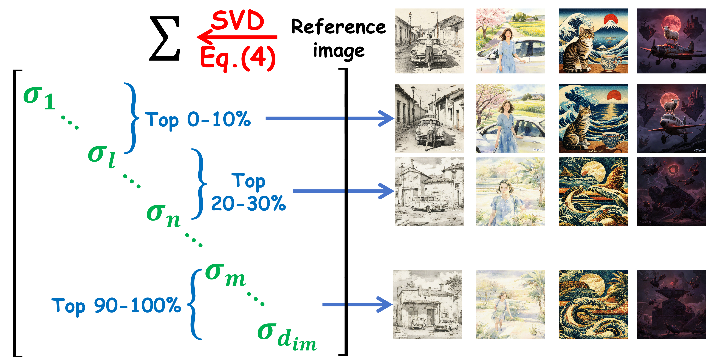
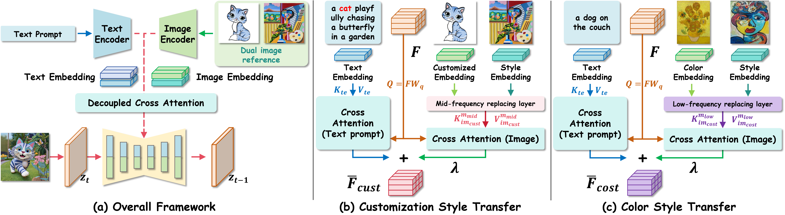
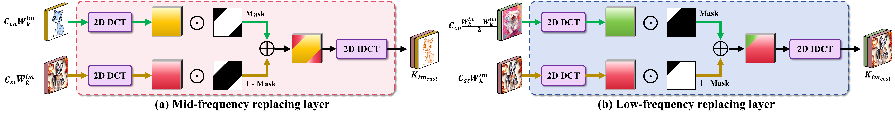
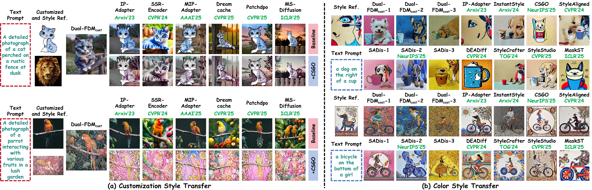
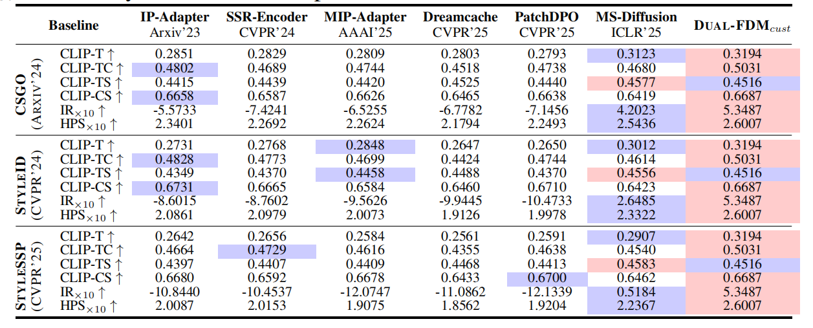
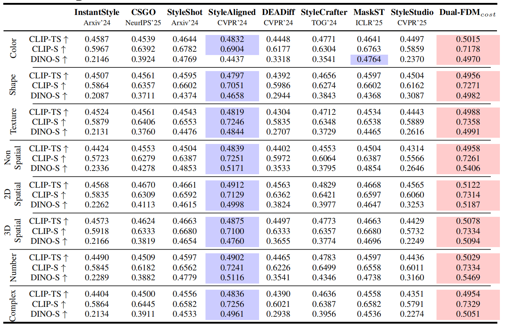
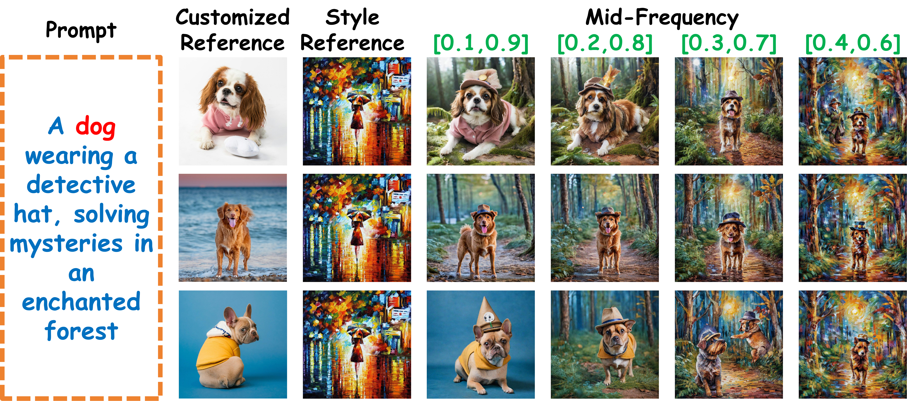
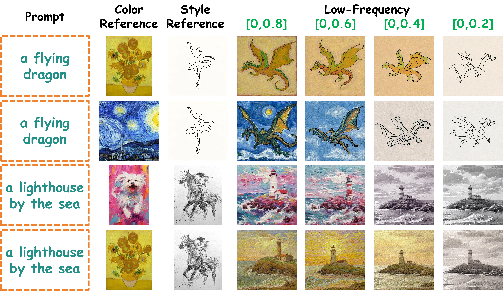
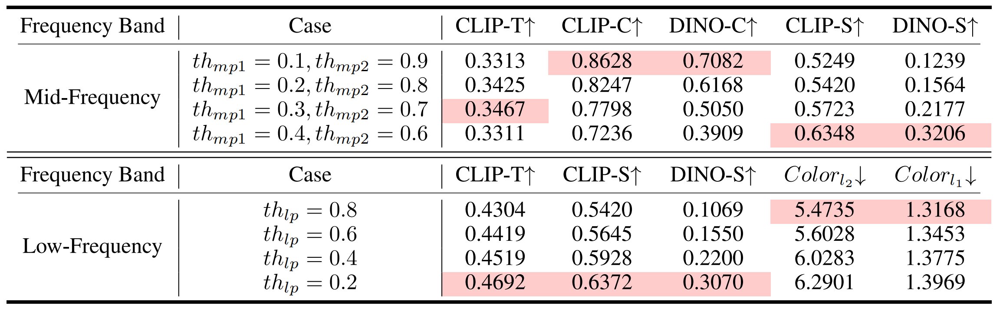

# Dual-FDM

This repository is the official code for the paper "Disentangling Dual Image References in Frequency Aware Diffusion Models for Personalized Generation" by Haipeng Liu (hpliu_hfut@hotmail.com), Yang Wang* (corresponding author: yangwang@hfut.edu.cn), Meng Wang. NeurIPS 2026, Sydney, Australia


<p align="center">Figure 1. Personalized images generated by our Dual-FDM.</p>

#
## Introduction

In this paper, we study personalized generation based on dual references - customization and color and style reference - and propose a paradigm to disentangle these Dual image references within Frequency-aware Diffusion Models, dubbed **Dual-FDM**, to simultaneously tackle two crucial personalized image generation tasks: customization style transfer and color style transfer, by disentangling different frequency bands via mask strategy within frequency domain. For customization style transfer,  we replace the mid-frequency band of the background in the style reference with that from the foreground of the customized reference. For color style transfer, we substitute the low-frequency band of the background in the style reference with that from both the foreground and background of the color reference. Both the substituted frequency bands are used as the key and value to reconstruct the query foreground and background of the denoised personalized image. We further compute the ratio of information entropy of the substituted frequency bands to adaptively modulate the denoising timesteps between the early and late stages. Extensive experiments validate the superiority of **Dual-FDM** over the state-of-the-art diffusion models for  personalized image generation. Our code can be accessed from the supplementary material package.

- Larger $\sigma_i$ tend to correspond to the foreground, whereas smaller $\sigma_i$ are more likely associated with the background. To suppress the foreground components and enhance the background components, we invert the singular values and construct the background matrix $\bar{W}_k^{im}$ as follows.

$$
\begin{aligned}
\overline{W}_k^{im}
&=
U \mathrm{diag}
\left(
\frac{1}{\sigma_1},
\frac{1}{\sigma_2},
\dots,
\frac{1}{\sigma_{d_{im}}}
\right)
V^T,
\quad \sigma_i \neq 0.
\end{aligned}
$$

<p align="center">

- For customization style transfer, we replace the **mid-frequency bands** of the background in the style reference with those from the foreground of the customized reference via mid-frequency replacing layer:

$$
\begin{aligned}
K^{m_{mid}}_{im_{cust}}
&=
\mathrm{IDCT}\Big(
\mathrm{DCT}(C_{cu} W_k^{im}) \odot m_{mid}
+
\mathrm{DCT}(C_{st} \overline{W}_k^{im}) \odot (1-m_{mid})
\Big), \\
V^{m_{mid}}_{im_{cust}}
&=
\mathrm{IDCT}\Big(
\mathrm{DCT}(C_{cu} W_v^{im}) \odot m_{mid}
+
\mathrm{DCT}(C_{st} W_v^{im}) \odot (1-m_{mid})
\Big).
\end{aligned}
$$


- For color style transfer, we replace the **low-frequency bands** of the background in the style reference with those from the foreground and the background of the color reference via low-frequency replacing layer:
  
$$
\begin{aligned}
K^{m_{low}}_{im_{cost}}
&=
\mathrm{IDCT}\Big(
\mathrm{DCT}\left(
C_{co}\left(
\frac{W_k^{im}+\overline{W}_k^{im}}{2}
\right)
\right)
\odot m_{low}
+
\mathrm{DCT}(C_{st}\overline{W}_k^{im})
\odot (1-m_{low})
\Big), \\
V^{m_{low}}_{im_{cost}}
&=
\mathrm{IDCT}\Big(
\mathrm{DCT}(C_{co}W_v^{im})
\odot m_{low}
+
\mathrm{DCT}(C_{st}W_v^{im})
\odot (1-m_{low})
\Big).
\end{aligned}
$$


<p align="center">Figure 2. Illustration of our proposed Dual-FDM pipeline.</p>


<p align="center">Figure 3. Illustration of (a) mid-frequency replacing layer and (b) low-frequency replacing layer.</p>


#
## Inference
   
1. Pre-trained models:
[RealVisXL_V5.0](https://huggingface.co/SG161222/RealVisXL_V5.0)
  
2. Run the following command:
```
Python3 test.py
```
* For customization style transfer, enable the corresponding code block below:
https://github.com/htyjers/Dual-FDM/blob/d7383509274d7bf09368951dd8cba90e4a93cf48/Dual-FDM/ip_adapter/attention_processor.py#L407-L469

* For color style transfer, enable the corresponding code block below:
https://github.com/htyjers/Dual-FDM/blob/8e973222453ba475bd2b46c68db5f95a33c1757f/Dual-FDM/ip_adapter/attention_processor.py#L471-L527


#
## Example Results

- Visual comparison between our method and the competitors.



- Quantitative results.
<p align="center">
<p align="center">

- Ablation Studies
<p align="center">
<p align="center">
<p align="center">


#


If any part of our paper and repository is helpful to your work, please generously cite with:

```
@inproceedings{liu2026disentangling,
title={Disentangling Dual Image References in Frequency Aware Diffusion Models for Personalized Generation},
author={Haipeng Liu and Yang Wang and Meng Wang},
booktitle={The Fortieth Annual Conference on Neural Information Processing Systems},
year={2026},
url={https://openreview.net/forum?id=l5xRQDiYkv}
}
```
